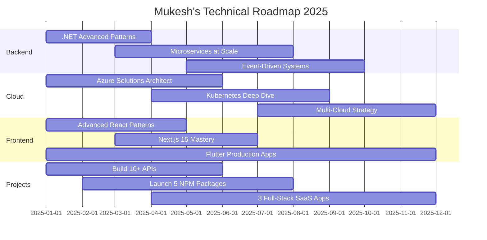

<div align="center">

<!-- Dynamic Wave Header -->


<!-- Dynamic Typing Animation -->


</div>

<br/>

<!-- Dynamic Snake Animation -->
<div align="center">
<picture>
  <source media="(prefers-color-scheme: dark)" srcset="https://raw.githubusercontent.com/mukeshjena/mukeshjena/output/github-contribution-grid-snake-dark.svg">
  <source media="(prefers-color-scheme: light)" srcset="https://raw.githubusercontent.com/mukeshjena/mukeshjena/output/github-contribution-grid-snake.svg">
  
</picture>
</div>

<br/>

<div align="center">

##  About Me

</div>

```typescript
const mukeshJena = {
    // Identity
    name: "Mukesh Jena",
    location: "📍 Ghaziabad, Uttar Pradesh, India",
    role: "Full-Stack Software Developer",
    tagline: "Passionate Learner | Coding Enthusiast | Ready to Make a Mark",
    
    // Technical Expertise
    languages: [
        "C#", "JavaScript", "TypeScript", "Python", 
        "Dart", "Java", "Go", "SQL"
    ],
    
    specializations: {
        backend: {
            dotnet: [".NET Core", ".NET 8/9", "ASP.NET Core", "Web API", 
                    "Entity Framework", "Dapper", "LINQ"],
            nodeJs: ["Express.js", "NestJS", "Fastify"],
            architecture: ["Clean Architecture", "CQRS", "Microservices", 
                          "Domain-Driven Design", "RESTful APIs", "GraphQL"]
        },
        
        frontend: {
            web: ["React", "Next.js", "Vue.js", "Angular"],
            mobile: ["Flutter", "React Native"],
            styling: ["Tailwind CSS", "Material-UI", "Bootstrap", "Styled Components"],
            stateManagement: ["Redux", "Zustand", "Context API", "BLoC", "Provider"]
        },
        
        cloud: {
            platforms: ["Azure", "AWS", "Google Cloud"],
            services: ["Azure Functions", "Lambda", "App Service", "Container Apps"],
            devOps: ["Azure DevOps", "GitHub Actions", "Docker", "Kubernetes"],
            iac: ["Terraform", "Bicep", "ARM Templates"],
            automation: ["CI/CD Pipelines", "Infrastructure as Code", "Cloud Orchestration"]
        },
        
        database: {
            sql: ["SQL Server", "PostgreSQL", "MySQL"],
            noSql: ["MongoDB", "Redis", "CosmosDB"],
            orm: ["Entity Framework Core", "Prisma", "Dapper"]
        },
        
        tools: {
            versionControl: ["Git", "GitHub", "Azure Repos"],
            ide: ["Visual Studio", "VS Code", "JetBrains Rider"],
            testing: ["xUnit", "NUnit", "Jest", "Cypress"],
            apiTools: ["Postman", "Swagger", "Insomnia"]
        }
    },
    
    // Projects & Contributions
    achievements: {
        publicRepos: 34,
        npmPackages: "Published multiple utility packages",
        cloudAutomations: "Built enterprise-level automation solutions",
        apisDeveloped: "50+ production-ready APIs",
        fullStackApps: "End-to-end web & mobile applications"
    },
    
    // Current Focus
    currentlyWorking: [
        "🎬 Filmify - Movie Discovery Platform",
        "📰 News Aggregator - Real-time News App",
        "🤖 AI-Powered Chat Applications",
        "☁️ Cloud Infrastructure Automation",
        "📦 Open Source NPM Packages"
    ],
    
    learning: [
        "Advanced .NET Performance Optimization",
        "Distributed Systems & Event-Driven Architecture",
        "Azure Cloud Native Applications",
        "Large Scale System Design",
        "Kubernetes Orchestration"
    ],
    
    currentFocus: "Building enterprise-grade, scalable solutions with modern tech stacks",
    
    funFact: "I speak fluent C# and JavaScript, but still debug with console.log()! 🐛☕",
    
    // Social
    connect: {
        portfolio: "https://mukeshjena.com",
        linkedin: "https://linkedin.com/in/mukesh-jena",
        twitter: "https://twitter.com/mukesh_jena07",
        email: "contact@mukeshjena.com"
    }
};

export default mukeshJena;
```

<br/>

<div align="center">

##  What I'm Building

</div>

<table align="center">
<tr>
<td width="50%" valign="top">

### 🔥 Active Projects

```yaml
backend_apis:
  - .NET Core Web APIs
  - RESTful Services
  - GraphQL Endpoints
  - Microservices Architecture
  
frontend_apps:
  - React Applications
  - Next.js Projects
  - Flutter Mobile Apps
  - Progressive Web Apps
  
cloud_solutions:
  - Azure Automation Scripts
  - Infrastructure as Code
  - CI/CD Pipelines
  - Serverless Functions
```

</td>
<td width="50%" valign="top">

### 🌱 Learning & Exploring

```yaml
advanced_topics:
  - Clean Architecture Patterns
  - Event-Driven Systems
  - Message Queues (RabbitMQ, Azure Service Bus)
  - CQRS with MediatR
  
performance:
  - .NET Performance Tuning
  - Database Optimization
  - Caching Strategies (Redis)
  - Load Balancing
  
devops:
  - Kubernetes Deep Dive
  - Docker Containerization
  - Azure DevOps Mastery
```

</td>
</tr>
</table>

<br/>

<div align="center">

##  Tech Stack & Expertise

### 🎯 Backend Development


### 🎨 Frontend Development


### 📱 Mobile Development


### ☁️ Cloud & DevOps


### 🗄️ Database & Caching


### 🛠️ Tools & Platforms


### 🏗️ Architecture & Patterns


</div>

<br/>

<div align="center">

## 📊 GitHub Analytics - Live Stats

<!-- Dynamic GitHub Stats -->
<div align="center">
<a href="https://github.com/mukeshjena">
  
  
</a>
</div>

<br/><br/>

<!-- Dynamic Streak Stats -->
<div align="center">
<a href="https://github.com/mukeshjena">
  
</a>
</div>

<br/><br/>

<!-- Dynamic Activity Graph -->
<div align="center">
<a href="https://github.com/mukeshjena">
  
</a>
</div>

<br/><br/>

<!-- Detailed Contribution Stats -->
<div align="center">


<br/>

<!-- Additional Stats Cards -->


</div>

</div>

<br/>

<div align="center">

## 🏆 GitHub Trophies - Dynamic Achievements

<a href="https://github.com/mukeshjena">
  
</a>

</div>

<br/>

<div align="center">

## 🌟 Featured Projects - Full-Stack Development Portfolio

</div>

<div align="center">
<table>
<tr>
<td width="50%" valign="top">

### 🏗️ Clean Architecture CQRS MediatR
<div align="center">  
<a href="https://github.com/mukeshjena/Clean-Architecture-CQRS-MediatR">

</a>
</div>

**Stack:** .NET Core • CQRS • MediatR • Clean Architecture  
**Features:** Enterprise patterns, separation of concerns  
**Highlights:** Production-ready API architecture, best practices

<p align="center">
<a href="https://github.com/mukeshjena/Clean-Architecture-CQRS-MediatR">


</a>
</p>

</td>

<td width="50%" valign="top">

### 📦 Lucid Alerts - NPM Package
<div align="center">
<a href="https://github.com/mukeshjena/lucid-alerts">

</a>
</div>

**Stack:** JavaScript • NPM • Open Source  
**Features:** Modern alert library, customizable notifications  
**Highlights:** Lightweight, alternative to SweetAlert2

<p align="center">
<a href="https://github.com/mukeshjena/lucid-alerts">


</a>
</p>

</td>
</tr>

<tr>
<td width="50%" valign="top">

### ☁️ CloudAMQP Inter-Network Communication
<div align="center">
<a href="https://github.com/mukeshjena/CloudAMQP-Inter-Network-Communication">

</a>
</div>

**Stack:** .NET Core • CloudAMQP • Message Queue • Cloud Automation  
**Features:** Inter-service communication, cloud messaging  
**Highlights:** Enterprise cloud automation, scalable architecture

<p align="center">
<a href="https://github.com/mukeshjena/CloudAMQP-Inter-Network-Communication">


</a>
</p>

</td>

<td width="50%" valign="top">

### 🚀 Email Service API - Full-Stack
<div align="center">
<a href="https://github.com/mukeshjena/email-service-api">

</a>
</div>

**Stack:** TypeScript • Node.js • REST API • Full-Stack  
**Features:** Email service, API endpoints, microservices  
**Highlights:** Production-ready service, scalable design

<p align="center">
<a href="https://github.com/mukeshjena/email-service-api">


</a>
</p>

</td>
</tr>

<tr>
<td width="50%" valign="top">

### 🎨 Groq AI Chat Application
<div align="center">
<a href="https://github.com/mukeshjena/groq-ai-chat-application">

</a>
</div>

**Stack:** TypeScript • React • AI/ML • Full-Stack  
**Features:** AI chat interface, real-time responses  
**Highlights:** Modern React app, AI integration

<p align="center">
<a href="https://github.com/mukeshjena/groq-ai-chat-application">


</a>
</p>

</td>

<td width="50%" valign="top">

### 🎬 Filmify - Movie Discovery Platform
<div align="center">
<a href="https://github.com/mukeshjena/Filmify">

</a>
</div>

**Stack:** Flutter • Dart • TMDb API • REST  
**Features:** Movie search, recommendations, favorites  
**Highlights:** Clean UI, responsive design, API integration

<p align="center">
<a href="https://github.com/mukeshjena/Filmify">


</a>
</p>

</td>
</tr>

<tr>
<td width="50%" valign="top">

### 🛡️ Void Browser - Privacy Browser
<div align="center">
<a href="https://github.com/mukeshjena/void-browser">

</a>
</div>

**Stack:** Flutter • Clean Architecture • Riverpod • Privacy  
**Features:** Ad-blocker, privacy-focused, lightweight  
**Highlights:** Production mobile app, clean architecture

<p align="center">
<a href="https://github.com/mukeshjena/void-browser">


</a>
</p>

</td>

<td width="50%" valign="top">

### 🏢 Cafeteria Management System
<div align="center">
<a href="https://github.com/mukeshjena/Cafeteria_Management_System">

</a>
</div>

**Stack:** JavaScript • Full-Stack • Web Application  
**Features:** Management system, CRUD operations  
**Highlights:** Complete full-stack solution

<p align="center">
<a href="https://github.com/mukeshjena/Cafeteria_Management_System">


</a>
</p>

</td>
</tr>
</table>
</div>

<br/>

<div align="center">

## 📈 Contribution Metrics - Real-Time

<div align="center">

</div>

</div>

<br/>

<div align="center">

## 💡 Dynamic Dev Quote


</div>

<br/>

<div align="center">

## 🤝 Let's Connect & Collaborate

<a href="https://www.linkedin.com/in/mukesh-jena/">

</a>
<a href="https://twitter.com/mukesh_jena07">

</a>
<a href="https://www.facebook.com/mukesh.jena.969">

</a>
<a href="https://www.instagram.com/_mukeshjena_/">

</a>
<a href="https://mukeshjena.com">

</a>
<a href="mailto:contact@mukeshjena.com">

</a>

</div>

<br/>

<div align="center">

## 📊 Live Profile Metrics


</div>

<br/>

<div align="center">

## 💼 Professional Expertise

<table>
<tr>
<td width="33%" valign="top" align="center">

### 🎯 Backend Development
**Building Robust APIs**

```csharp
// .NET Core Web API
[ApiController]
[Route("api/[controller]")]
public class UserController 
{
    // Clean Architecture
    // CQRS Pattern
    // Entity Framework
}
```

✅ RESTful APIs  
✅ Microservices  
✅ Clean Architecture  
✅ Entity Framework  
✅ LINQ & Dapper

</td>
<td width="33%" valign="top" align="center">

### ☁️ Cloud & DevOps
**Automating Infrastructure**

```yaml
# Azure Pipeline
trigger: [main]
pool:
  vmImage: 'ubuntu-latest'
steps:
  - task: Docker@2
  - task: Kubernetes@1
  - task: AzureCLI@2
```

✅ Azure/AWS/GCP  
✅ Docker & K8s  
✅ CI/CD Pipelines  
✅ Infrastructure as Code  
✅ Cloud Automation

</td>
<td width="33%" valign="top" align="center">

### 🎨 Frontend & Mobile
**Crafting User Experiences**

```javascript
// React Component
const App = () => {
  // Redux State
  // React Hooks
  // Modern UI/UX
  return <Beautiful UI />
}
```

✅ React/Next.js  
✅ Flutter Apps  
✅ Responsive Design  
✅ State Management  
✅ Modern UI/UX

</td>
</tr>
</table>

</div>

<br/>

<div align="center">

## 🎯 2025 Development Roadmap



</div>

<br/>

<div align="center">

## 🏅 Skills & Certifications

| Category | Technologies | Proficiency |
|----------|-------------|-------------|
| **Backend** | .NET Core, C#, Node.js, Python | ⭐⭐⭐⭐⭐ |
| **Frontend** | React, Next.js, TypeScript, Vue | ⭐⭐⭐⭐⭐ |
| **Mobile** | Flutter, Dart, React Native | ⭐⭐⭐⭐⭐ |
| **Cloud** | Azure, AWS, Docker, Kubernetes | ⭐⭐⭐⭐ |
| **Database** | SQL Server, PostgreSQL, MongoDB | ⭐⭐⭐⭐⭐ |
| **DevOps** | CI/CD, GitHub Actions, Terraform | ⭐⭐⭐⭐ |

</div>

<br/>

<div align="center">

## 📚 Latest Activity - Auto-Updated

<!--START_SECTION:activity-->
<!-- GitHub activity will be automatically updated here -->
<!--END_SECTION:activity-->

</div>

<br/>

<div align="center">

## 🎖️ Achievements & Milestones

```yaml
repositories:
  total: 34
  stars_received: 3+
  forks: Multiple
  
contributions:
  commits: 500+
  pull_requests: 10+
  issues_resolved: 5+
  
expertise:
  backend_apis: "50+ production APIs"
  npm_packages: "Published utility packages"
  cloud_automation: "Enterprise solutions"
  full_stack_apps: "End-to-end applications"
  
open_source:
  status: "Active Contributor"
  focus: "Quality over quantity"
```

</div>

<br/>

<div align="center">

## 🚀 Current Goals

<table>
<tr>
<td align="center">🎯</td>
<td><strong>Master Advanced .NET Patterns</strong><br/>CQRS, Event Sourcing, DDD</td>
<td align="center">🔄 In Progress</td>
</tr>
<tr>
<td align="center">☁️</td>
<td><strong>Azure Solutions Architect</strong><br/>Cloud-native applications at scale</td>
<td align="center">📚 Learning</td>
</tr>
<tr>
<td align="center">🌐</td>
<td><strong>Build 10+ Production APIs</strong><br/>RESTful & GraphQL endpoints</td>
<td align="center">🚀 Active</td>
</tr>
<tr>
<td align="center">📦</td>
<td><strong>Publish 5 NPM Packages</strong><br/>Open source contributions</td>
<td align="center">📝 Planning</td>
</tr>
<tr>
<td align="center">📱</td>
<td><strong>Launch 5 Mobile Apps</strong><br/>Flutter & React Native</td>
<td align="center">💪 Building</td>
</tr>
<tr>
<td align="center">🤝</td>
<td><strong>Open Source Leadership</strong><br/>Contribute to major projects</td>
<td align="center">✨ Ongoing</td>
</tr>
</table>

</div>

<br/>

<div align="center">

### 💬 "First, solve the problem. Then, write the code." - John Johnson

### 🚀 Open to exciting opportunities and collaborations!

### ⭐ From [mukeshjena](https://github.com/mukeshjena) with ❤️

### Built with passion | Powered by innovation | Driven by excellence


</div>
