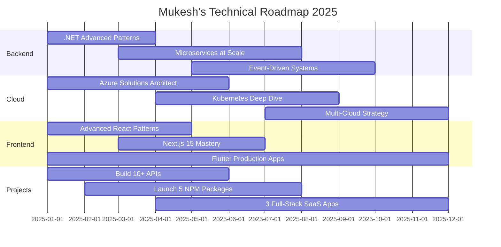

<!-- Dynamic Wave Header -->

<!-- Dynamic Typing Animation -->

 

<!-- Dynamic Snake Animation -->

<picture>
  <source media="(prefers-color-scheme: dark)" srcset="https://raw.githubusercontent.com/mukeshjena/mukeshjena/output/github-contribution-grid-snake-dark.svg">
  <source media="(prefers-color-scheme: light)" srcset="https://raw.githubusercontent.com/mukeshjena/mukeshjena/output/github-contribution-grid-snake.svg">
  
</picture>

 

##  About Me

### 👋 Hello, I'm Mukesh Jena

**Passionate Learner | Coding Enthusiast | Ready to Make a Mark**

 

### 🎯 Quick Overview

<table>
<tr>
<td width="50%" valign="top">

#### 💼 Professional Identity

**Full-Stack Software Developer**  
*Building enterprise-grade solutions*

📍 **Location:** Ghaziabad, Uttar Pradesh, India  
🎯 **Focus:** Enterprise-grade, scalable solutions  
🚀 **Mission:** Quality over quantity

</td>
<td width="50%" valign="top">

#### 🛠️ Core Technologies

</td>
</tr>
</table>

 

### 🎨 Specializations

<table>
<tr>
<td width="33.3%" valign="top">

#### 🏗️ Backend Development

**Technologies:**
- .NET Core & .NET 8/9
- ASP.NET Core & Web API
- Node.js (Express, NestJS)
- Entity Framework & Dapper
- Clean Architecture & CQRS
- Microservices & DDD

</td>
<td width="33.3%" valign="top">

#### 🎨 Frontend & Mobile

**Technologies:**
- React, Next.js, Vue.js, Angular
- Flutter & React Native
- Tailwind CSS & Material-UI
- Redux, Zustand, Context API
- TypeScript & Modern JavaScript

</td>
<td width="33.3%" valign="top">

#### ☁️ Cloud & DevOps

**Technologies:**
- Azure, AWS, Google Cloud
- Docker & Kubernetes
- CI/CD Pipelines
- Terraform & Infrastructure as Code
- Azure DevOps & GitHub Actions

</td>
</tr>
</table>

 

### 📊 Key Achievements

<table>
<tr>
<td width="25%" valign="top" align="center">

**34 Public Repos**

</td>
<td width="25%" valign="top" align="center">

**50+ Production APIs**

</td>
<td width="25%" valign="top" align="center">

**Published Packages**

</td>
<td width="25%" valign="top" align="center">

**Enterprise Solutions**

</td>
</tr>
</table>

 

### 🚀 Currently Working On

- 🎬 **Filmify** - Movie Discovery Platform
- 📰 **News Aggregator** - Real-time News App
- 🤖 **AI-Powered Chat** Applications
- ☁️ **Cloud Infrastructure** Automation
- 📦 **Open Source** NPM Packages

 

### 📚 Currently Learning

- Advanced .NET Performance Optimization
- Distributed Systems & Event-Driven Architecture
- Azure Cloud Native Applications
- Large Scale System Design
- Kubernetes Orchestration

 

### 💡 Fun Fact

> *"I speak fluent C# and JavaScript, but still debug with console.log()! 🐛☕"*

 

### 🌐 Connect With Me

 

##  What I'm Building

### 🔥 Active Projects & Development

<table>
<tr>
<td width="33.3%" valign="top">

#### 🏗️ Backend APIs

- ✅ .NET Core Web APIs
- ✅ RESTful Services
- ✅ GraphQL Endpoints
- ✅ Microservices Architecture

</td>
<td width="33.3%" valign="top">

#### 🎨 Frontend & Mobile Apps

- ✅ React Applications
- ✅ Next.js Projects
- ✅ Flutter Mobile Apps
- ✅ Progressive Web Apps

</td>
<td width="33.3%" valign="top">

#### ☁️ Cloud Solutions

- ✅ Azure Automation Scripts
- ✅ Infrastructure as Code
- ✅ CI/CD Pipelines
- ✅ Serverless Functions

</td>
</tr>
</table>

 

### 🌱 Learning & Exploring

<table>
<tr>
<td width="33.3%" valign="top">

#### 🏛️ Advanced Topics

- 📚 Clean Architecture Patterns
- 📚 Event-Driven Systems
- 📚 Message Queues (RabbitMQ, Azure Service Bus)
- 📚 CQRS with MediatR

</td>
<td width="33.3%" valign="top">

#### ⚡ Performance Optimization

- 📚 .NET Performance Tuning
- 📚 Database Optimization
- 📚 Caching Strategies (Redis)
- 📚 Load Balancing

</td>
<td width="33.3%" valign="top">

#### 🚀 DevOps Mastery

- 📚 Kubernetes Deep Dive
- 📚 Docker Containerization
- 📚 Azure DevOps Mastery
- 📚 Infrastructure Automation

</td>
</tr>
</table>

 

### 🎯 Project Focus Areas

 

##  Tech Stack & Expertise

### 🎯 Backend Development

### 🎨 Frontend Development

### 📱 Mobile Development

### ☁️ Cloud & DevOps

### 🗄️ Database & Caching

### 🛠️ Tools & Platforms

### 🏗️ Architecture & Patterns

 

## 📊 GitHub Analytics - Live Stats

<!-- Dynamic GitHub Stats -->

  

<!-- Dynamic Streak Stats -->

  

<!-- Dynamic Activity Graph -->

  

<!-- Detailed Contribution Stats -->

 

<!-- Additional Stats Cards -->

 

 

## 🌟 Featured Projects - Full-Stack Development Portfolio

### 🏗️ Backend & Architecture Projects

<table>
<tr>
<td width="50%" valign="top">

#### 🏗️ Clean Architecture CQRS MediatR

**Features:** Enterprise patterns, separation of concerns  
**Highlights:** Production-ready API architecture, best practices

</td>

<td width="50%" valign="top">

#### ☁️ CloudAMQP Inter-Network Communication

**Features:** Inter-service communication, cloud messaging  
**Highlights:** Enterprise cloud automation, scalable architecture

</td>
</tr>
</table>

 

### 🚀 Full-Stack & API Projects

<table>
<tr>
<td width="50%" valign="top">

#### 🚀 Email Service API - Full-Stack

**Features:** Email service, API endpoints, microservices  
**Highlights:** Production-ready service, scalable design

</td>

<td width="50%" valign="top">

#### 🏢 Cafeteria Management System

**Features:** Management system, CRUD operations  
**Highlights:** Complete full-stack solution

</td>
</tr>
</table>

 

### 🎨 Frontend & AI Projects

<table>
<tr>
<td width="50%" valign="top">

#### 🎨 Groq AI Chat Application

**Features:** AI chat interface, real-time responses  
**Highlights:** Modern React app, AI integration

</td>

<td width="50%" valign="top">

#### 📦 Lucid Alerts - NPM Package

**Features:** Modern alert library, customizable notifications  
**Highlights:** Lightweight, alternative to SweetAlert2

</td>
</tr>
</table>

 

### 📱 Mobile Applications

<table>
<tr>
<td width="50%" valign="top">

#### 🎬 Filmify - Movie Discovery Platform

**Features:** Movie search, recommendations, favorites  
**Highlights:** Clean UI, responsive design, API integration

</td>

<td width="50%" valign="top">

#### 🛡️ Void Browser - Privacy Browser

**Features:** Ad-blocker, privacy-focused, lightweight  
**Highlights:** Production mobile app, clean architecture

</td>
</tr>
</table>

 

## 💡 Daily Developer Inspiration

 

## 🤝 Let's Connect & Collaborate

 

## 📊 Live Profile Metrics

 

## 💼 Professional Expertise

### 🎯 Backend Development
**Building Robust & Scalable APIs**

<table>
<tr>
<td width="50%" valign="top">

**Core Technologies:**
- ✅ RESTful APIs & GraphQL
- ✅ Microservices Architecture
- ✅ Clean Architecture Patterns
- ✅ Entity Framework Core
- ✅ LINQ & Dapper ORM

</td>
<td width="50%" valign="top">

**Advanced Patterns:**
- ✅ CQRS & Event Sourcing
- ✅ Domain-Driven Design (DDD)
- ✅ Repository Pattern
- ✅ Dependency Injection
- ✅ API Gateway Pattern

</td>
</tr>
</table>

 

### ☁️ Cloud & DevOps
**Automating Infrastructure & CI/CD**

<table>
<tr>
<td width="50%" valign="top">

**Cloud Platforms:**
- ✅ Microsoft Azure
- ✅ Amazon Web Services (AWS)
- ✅ Google Cloud Platform
- ✅ Azure Functions & Lambda
- ✅ Container Apps & App Service

</td>
<td width="50%" valign="top">

**DevOps & Automation:**
- ✅ CI/CD Pipelines (GitHub Actions, Azure DevOps)
- ✅ Infrastructure as Code (Terraform, Bicep)
- ✅ Docker & Kubernetes
- ✅ Cloud Orchestration
- ✅ Monitoring & Logging

</td>
</tr>
</table>

 

### 🎨 Frontend & Mobile Development
**Crafting Modern User Experiences**

<table>
<tr>
<td width="50%" valign="top">

**Web Technologies:**
- ✅ React & Next.js
- ✅ TypeScript & JavaScript
- ✅ Vue.js & Angular
- ✅ Tailwind CSS & Material-UI
- ✅ Redux & Zustand State Management

</td>
<td width="50%" valign="top">

**Mobile Development:**
- ✅ Flutter & Dart
- ✅ React Native
- ✅ Cross-platform Apps
- ✅ Responsive Design
- ✅ Modern UI/UX Patterns

</td>
</tr>
</table>

 

### 🗄️ Database & Caching
**Data Management & Performance**

<table>
<tr>
<td width="50%" valign="top">

**SQL Databases:**
- ✅ SQL Server
- ✅ PostgreSQL
- ✅ MySQL
- ✅ Entity Framework Core
- ✅ Dapper & ADO.NET

</td>
<td width="50%" valign="top">

**NoSQL & Caching:**
- ✅ MongoDB
- ✅ Redis Cache
- ✅ CosmosDB
- ✅ Database Optimization
- ✅ Query Performance Tuning

</td>
</tr>
</table>

 

## 🎯 2025 Development Roadmap

 

## 🏅 Skills & Certifications

| Category | Technologies | Proficiency |
|----------|-------------|-------------|
| **Backend** | .NET Core, C#, Node.js, Python | ⭐⭐⭐⭐⭐ |
| **Frontend** | React, Next.js, TypeScript, Vue | ⭐⭐⭐⭐⭐ |
| **Mobile** | Flutter, Dart, React Native | ⭐⭐⭐⭐⭐ |
| **Cloud** | Azure, AWS, Docker, Kubernetes | ⭐⭐⭐⭐ |
| **Database** | SQL Server, PostgreSQL, MongoDB | ⭐⭐⭐⭐⭐ |
| **DevOps** | CI/CD, GitHub Actions, Terraform | ⭐⭐⭐⭐ |

 

## 📚 Latest Activity - Auto-Updated

<!--RECENT_ACTIVITY:start-->
1. ⬆️ Pushed commit to [mukeshjena](https://github.com/mukeshjena/mukeshjena)    Update README.md (1w ago)
2. ⬆️ Pushed commit to [seo-site-sg](https://github.com/mukeshjena/seo-site-sg)    change the icon (4w ago)
3. ⬆️ Pushed commit to [lucid-alerts](https://github.com/mukeshjena/lucid-alerts)    Release v1.1.3: Updated documentation, version references, and stable NPM releas (12w ago)
4. ⬆️ Pushed commit to [fashion-shop](https://github.com/mukeshjena/fashion-shop)    Update App.tsx (13w ago)
5. ⬆️ Pushed commit to [Filmify](https://github.com/mukeshjena/Filmify)    Update api.dart (116w ago)
<!--RECENT_ACTIVITY:end-->

 

## 🎖️ Achievements & Milestones

### 📊 Repository Achievements

 

### 💻 Contribution Achievements

<table>
<tr>
<td width="33.3%" valign="top" align="center">

#### 📝 Commits

**500+ Total Commits**  
*Consistent contributions*

</td>
<td width="33.3%" valign="top" align="center">

#### 🔀 Pull Requests

**10+ Pull Requests**  
*Active collaboration*

</td>
<td width="33.3%" valign="top" align="center">

#### 🐛 Issues Resolved

**5+ Issues Resolved**  
*Problem solving*

</td>
</tr>
</table>

 

### 🚀 Expertise Milestones

<table>
<tr>
<td width="50%" valign="top">

#### 🏗️ Backend & APIs

**50+ Production APIs**  
Built with .NET Core, Node.js, and modern architectures

</td>
<td width="50%" valign="top">

#### 📦 NPM Packages

**Published Utility Packages**  
Open source contributions to the community

</td>
</tr>
<tr>
<td width="50%" valign="top">

#### ☁️ Cloud Automation

**Enterprise Solutions**  
Infrastructure as Code & Automation

</td>
<td width="50%" valign="top">

#### 🌐 Full-Stack Apps

**End-to-End Applications**  
Complete solutions from frontend to backend

</td>
</tr>
</table>

 

### 🌟 Open Source Status

**Active Contributor** | **Quality over Quantity**

 

## 🚀 Current Goals

<table>
<tr>
<td align="center">🎯</td>
<td><strong>Master Advanced .NET Patterns</strong> CQRS, Event Sourcing, DDD</td>
<td align="center">🔄 In Progress</td>
</tr>
<tr>
<td align="center">☁️</td>
<td><strong>Azure Solutions Architect</strong> Cloud-native applications at scale</td>
<td align="center">📚 Learning</td>
</tr>
<tr>
<td align="center">🌐</td>
<td><strong>Build 10+ Production APIs</strong> RESTful & GraphQL endpoints</td>
<td align="center">🚀 Active</td>
</tr>
<tr>
<td align="center">📦</td>
<td><strong>Publish 5 NPM Packages</strong> Open source contributions</td>
<td align="center">📝 Planning</td>
</tr>
<tr>
<td align="center">📱</td>
<td><strong>Launch 5 Mobile Apps</strong> Flutter & React Native</td>
<td align="center">💪 Building</td>
</tr>
<tr>
<td align="center">🤝</td>
<td><strong>Open Source Leadership</strong> Contribute to major projects</td>
<td align="center">✨ Ongoing</td>
</tr>
</table>

 

### 💬 "First, solve the problem. Then, write the code." - John Johnson

### 🚀 Open to exciting opportunities and collaborations!

### ⭐ From [mukeshjena](https://github.com/mukeshjena) with ❤️

### Built with passion | Powered by innovation | Driven by excellence

