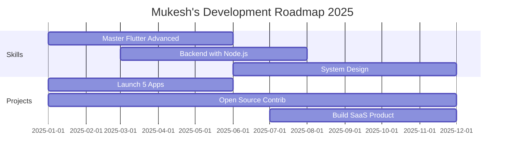

<div align="center">

<!-- Animated Wave Header with Custom Design -->


<!-- Dynamic Typing Animation -->


</div>

<br/>

<!-- Dynamic Snake Animation - Shows Real Contributions -->
<picture>
  <source media="(prefers-color-scheme: dark)" srcset="https://raw.githubusercontent.com/mukeshjena/mukeshjena/output/github-contribution-grid-snake-dark.svg">
  <source media="(prefers-color-scheme: light)" srcset="https://raw.githubusercontent.com/mukeshjena/mukeshjena/output/github-contribution-grid-snake.svg">
  
</picture>

<br/>

<div align="center">

##  About Me

</div>

```dart
class MukeshJena {
  // Basic Info
  final String name = "Mukesh Jena";
  final String location = "📍 Ghaziabad, Uttar Pradesh, India";
  final String role = "Flutter Developer | Mobile App Enthusiast";
  final String tagline = "Passionate Learner | Coding Enthusiast | Ready to Make a Mark";
  
  // Technical Skills
  List<String> languages = [
    "Dart", "JavaScript", "Python", "Java", "C++"
  ];
  
  Map<String, dynamic> expertise = {
    "mobile": ["Flutter", "Dart", "Android", "iOS", "Cross-Platform"],
    "frontend": ["HTML5", "CSS3", "JavaScript", "React", "Responsive Design"],
    "backend": ["Node.js", "Express", "REST APIs", "Firebase"],
    "database": ["Firebase Firestore", "SQLite", "MongoDB", "Supabase"],
    "stateManagement": ["Provider", "Riverpod", "BLoC", "GetX"],
    "tools": ["Git", "VS Code", "Android Studio", "Figma", "Postman"],
    "architecture": ["MVVM", "Clean Architecture", "Repository Pattern"]
  };
  
  // Current Activities
  List<String> currentlyBuilding = [
    "🎬 Filmify - Movie Discovery App",
    "📰 News App - Real-time News Aggregator",
    "💬 ChatGPT Integration App",
    "📝 NoteMate - Smart Note Taking",
    "🎮 Interactive Games"
  ];
  
  List<String> learning = [
    "Advanced Flutter Animations",
    "Microservices Architecture", 
    "Cloud Native Development",
    "AI/ML Integration in Mobile Apps"
  ];
  
  // Achievements
  Map<String, int> stats = {
    "publicRepos": 34,
    "totalCommits": 500,
    "pullRequests": 10,
    "issuesResolved": 5
  };
  
  String currentFocus = "Building production-ready Flutter apps with clean architecture";
  String funFact = "I debug with print() statements and I'm proud of it! 🐛☕";
  
  // Contact
  Map<String, String> socialLinks = {
    "portfolio": "https://mukeshjena.com",
    "linkedin": "https://linkedin.com/in/mukesh-jena",
    "twitter": "https://twitter.com/mukesh_jena07",
    "facebook": "https://facebook.com/mukesh.jena.969",
    "instagram": "https://instagram.com/_mukeshjena_"
  };
  
  void introduce() {
    print('''
    🚀 Hey there! I'm $name
    🎯 Focus: $currentFocus
    💡 $tagline
    📧 Let's connect and build something amazing!
    ''');
  }
}
```

<br/>

<div align="center">

##  Current Mission

</div>

<table align="center">
<tr>
<td width="50%" valign="top">

### 🔥 Working On
```yaml
projects:
  - name: "Filmify"
    tech: [Flutter, TMDb API, REST]
    status: "⭐ Active - 3 Stars"
    
  - name: "News App" 
    tech: [Flutter, News API, HTTP]
    status: "🚀 Building"
    
  - name: "ChatGPT App"
    tech: [Flutter, OpenAI, AI]
    status: "🤖 AI Integration"
    
  - name: "NoteMate"
    tech: [Flutter, SQLite, CRUD]
    status: "📝 Production"
```

</td>
<td width="50%" valign="top">

### 🌱 Learning Journey
```yaml
current_learning:
  flutter:
    - Custom Animations
    - Advanced Widgets
    - Performance Optimization
    
  architecture:
    - Clean Architecture
    - SOLID Principles
    - Design Patterns
    
  backend:
    - Firebase Cloud Functions
    - RESTful API Design
    - Microservices
```

</td>
</tr>
</table>

<br/>

<div align="center">

##  Tech Stack

### 📱 Mobile Development


### 💻 Programming Languages


### 🎨 Frontend Technologies


### ⚡ Backend & Database


### 🛠️ Tools & Platforms


### 🔧 State Management


</div>

<br/>

<div align="center">

## 📊 GitHub Analytics - Live Stats

<!-- Dynamic GitHub Stats -->
<a href="https://github.com/mukeshjena">
  
  
</a>

<br/><br/>

<!-- Dynamic Streak Stats -->
<a href="https://github.com/mukeshjena">
  
</a>

<br/><br/>

<!-- Dynamic Activity Graph -->
<a href="https://github.com/mukeshjena">
  
</a>

<br/><br/>

<!-- Detailed Contribution Stats -->


<br/>

<!-- Additional Stats Cards -->


</div>

<br/>

<div align="center">

## 🏆 GitHub Trophies - Dynamic Achievements

<a href="https://github.com/mukeshjena">
  
</a>

</div>

<br/>

<div align="center">

## 🌟 Pinned Projects - Auto-Updated

</div>

<div align="center">
<table>
<tr>
<td width="50%" valign="top">

### 🎬 Filmify
<div align="center">  
<a href="https://github.com/mukeshjena/Filmify">

</a>
</div>

**Tech:** Flutter • Dart • TMDb API • REST API  
**Features:** Real-time movie data, Search, Favorites  
**Status:** ⭐ Live & Active

<p align="center">
<a href="https://github.com/mukeshjena/Filmify">


</a>
</p>

</td>

<td width="50%" valign="top">

### 📝 NoteMate
<div align="center">
<a href="https://github.com/mukeshjena/NoteMate">

</a>
</div>

**Tech:** Flutter • SQLite • CRUD • Local Storage  
**Features:** Create, Read, Update, Delete notes  
**Status:** 🚀 Production Ready

<p align="center">
<a href="https://github.com/mukeshjena/NoteMate">


</a>
</p>

</td>
</tr>

<tr>
<td width="50%" valign="top">

### 📰 News App
<div align="center">
<a href="https://github.com/mukeshjena/news_app_flutter">

</a>
</div>

**Tech:** Flutter • News API • HTTP • JSON  
**Features:** Real-time news, Categories, Search  
**Status:** 📱 Active Development

<p align="center">
<a href="https://github.com/mukeshjena/news_app_flutter">


</a>
</p>

</td>

<td width="50%" valign="top">

### 🤖 ChatGPT App
<div align="center">
<a href="https://github.com/mukeshjena/chat_gpt_app_flutter">

</a>
</div>

**Tech:** Flutter • OpenAI API • AI • Chat  
**Features:** AI chat, Conversations, Smart replies  
**Status:** 🤖 AI-Powered

<p align="center">
<a href="https://github.com/mukeshjena/chat_gpt_app_flutter">


</a>
</p>

</td>
</tr>

<tr>
<td width="50%" valign="top">

### ⚖️ BMI Calculator
<div align="center">
<a href="https://github.com/mukeshjena/bmi_calculator">

</a>
</div>

**Tech:** Flutter • Dart • Material Design  
**Features:** Calculate BMI, Health tips  
**Status:** ✅ Complete

<p align="center">
<a href="https://github.com/mukeshjena/bmi_calculator">


</a>
</p>

</td>

<td width="50%" valign="top">

### 🎮 Tic Tac Toe
<div align="center">
<a href="https://github.com/mukeshjena/tic_tac_toe">

</a>
</div>

**Tech:** Flutter • Game Logic • Animations  
**Features:** 2-player game, Score tracking  
**Status:** 🎮 Playable

<p align="center">
<a href="https://github.com/mukeshjena/tic_tac_toe">


</a>
</p>

</td>
</tr>
</table>
</div>

<br/>

<div align="center">

## 📈 Contribution Metrics - Real-Time

<!-- Dynamic Metrics -->


</div>

<br/>

<div align="center">

## 💡 Dynamic Dev Quote


</div>

<br/>

<div align="center">

## 🤝 Let's Connect & Collaborate

<a href="https://www.linkedin.com/in/mukesh-jena/">

</a>
<a href="https://twitter.com/mukesh_jena07">

</a>
<a href="https://www.facebook.com/mukesh.jena.969">

</a>
<a href="https://www.instagram.com/_mukeshjena_/">

</a>
<a href="https://mukeshjena.com">

</a>
<a href="mailto:contact@mukeshjena.com">

</a>

</div>

<br/>

<div align="center">

## 📊 Live Profile Metrics


</div>

<br/>

<div align="center">

## 💼 GitHub Summary - Auto-Generated


</div>

<br/>

<div align="center">

## 🎯 2025 Goals & Roadmap



### Milestones

✅ **Completed**
- 34+ Public Repositories Created
- Flutter Development Mastery
- Multiple Production Apps

🔄 **In Progress**
- Advanced State Management
- Cloud Integration
- UI/UX Excellence
- Open Source Contributions

🎯 **Upcoming**
- Launch Apps on Play Store
- Build 10+ Production Apps
- Master Backend Development
- Contribute to Major OSS Projects
- Learn System Design
- Build Personal SaaS Product

</div>

<br/>

<div align="center">

## 📚 Latest Activity - Auto-Updated

<!--START_SECTION:activity-->
<!-- This will be automatically updated by GitHub Actions -->
<!--END_SECTION:activity-->

</div>

<br/>

<div align="center">

### 💭 "Code is poetry written in logic" 

### 🚀 Open to collaborate on exciting Flutter projects!

### ⭐ From [mukeshjena](https://github.com/mukeshjena) with ❤️ 

### Made with Flutter 🦋 | Powered by Passion 🔥


</div>
