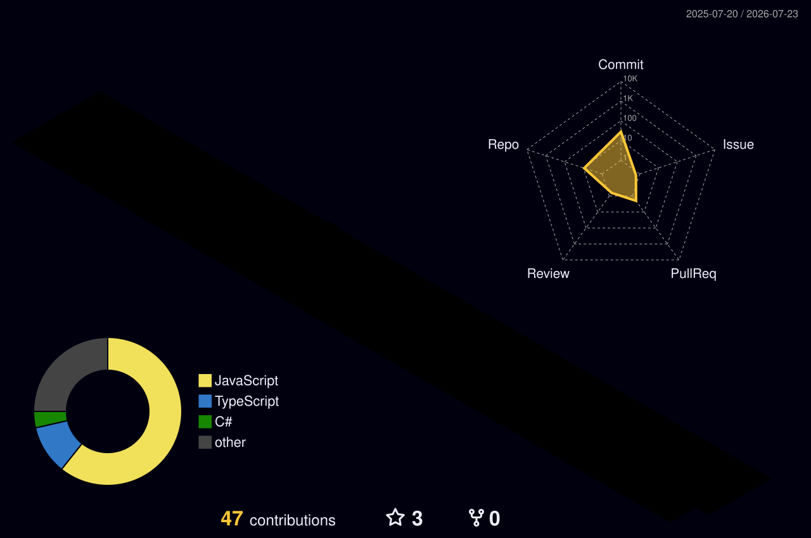

<!-- ═══════════════════ 🌊 HEADER ═══════════════════ -->

<!-- ═══════════════════ ⌨️ TYPING ═══════════════════ -->

  

<!-- ═══════════════════ 🐍 SNAKE ═══════════════════ -->

<picture>
  <source media="(prefers-color-scheme: dark)" srcset="https://raw.githubusercontent.com/mukeshjena/mukeshjena/output/github-contribution-grid-snake-dark.svg">
  <source media="(prefers-color-scheme: light)" srcset="https://raw.githubusercontent.com/mukeshjena/mukeshjena/output/github-contribution-grid-snake.svg">
  
</picture>

 

<!-- ═══════════════════ 👋 ABOUT ME ═══════════════════ -->

<h2 align="center">
  &nbsp; About Me
</h2>

  
  
  

<i>Full-stack developer shipping enterprise-grade backends and modern front-ends. 35 public repos • 50+ production APIs • Published NPM packages</i>

 

<!-- ═══════════════════ 🛠️ TECH STACK ═══════════════════ -->

<h2 align="center">
  &nbsp; Tech Stack
</h2>

**Languages**

**Backend & Frameworks**

**Frontend & Mobile**

**Cloud & DevOps**

**Databases**

 

<!-- ═══════════════════ 📊 GITHUB STATS ═══════════════════ -->

<h2 align="center">📊 GitHub Analytics</h2>

  

 

<!-- ═══════════════════ 🧊 3D CONTRIBUTION ═══════════════════ -->

<h2 align="center">🧊 3D Contribution Calendar</h2>

  <picture>
    <source media="(prefers-color-scheme: dark)" srcset="./profile-3d-contrib/profile-night-rainbow.svg">
    <source media="(prefers-color-scheme: light)" srcset="./profile-3d-contrib/profile-green-animate.svg">
    
  </picture>

 

<!-- ═══════════════════ 📈 ACTIVITY GRAPH ═══════════════════ -->

<h2 align="center">📈 Contribution Graph</h2>

  

 

<!-- ═══════════════════ ⚡ RECENT ACTIVITY ═══════════════════ -->

<h2 align="center">⚡ Recent GitHub Activity</h2>

<!--RECENT_ACTIVITY:start-->

| 🔹 | Repository | Commit | Date |
|:--:|:-----------|:-------|:----:|
| 🔨 | [mukeshjena](https://github.com/mukeshjena/mukeshjena) | `Delete README.md` | Jul 21 |
| 🔨 | [mukeshjena](https://github.com/mukeshjena/mukeshjena) | `Update README.md` | Jul 21 |
| 🔨 | [mukeshjena](https://github.com/mukeshjena/mukeshjena) | `Update README.md` | Dec 12 |
| 🔨 | [lucid-alerts](https://github.com/mukeshjena/lucid-alerts) | `Release v1.1.3: Updated documentation, version references...` | Sep 24 |
| 🔨 | [lucid-alerts](https://github.com/mukeshjena/lucid-alerts) | `1.1.3` | Sep 24 |
| 🔨 | [lucid-alerts](https://github.com/mukeshjena/lucid-alerts) | `1.1.2` | Sep 24 |
| 🔨 | [fashion-shop](https://github.com/mukeshjena/fashion-shop) | `Update App.tsx` | Sep 15 |
| 🔨 | [fashion-shop](https://github.com/mukeshjena/fashion-shop) | `Update App.tsx` | Sep 15 |
| 🔨 | [fashion-shop](https://github.com/mukeshjena/fashion-shop) | `Update App.tsx` | Sep 15 |
| 🔨 | [Filmify](https://github.com/mukeshjena/Filmify) | `Update api.dart` | Sep 28 |
<!--RECENT_ACTIVITY:end-->

 

<!-- ═══════════════════ 🌐 CONNECT ═══════════════════ -->

<h2 align="center">🌐 Connect With Me</h2>

  
  
  
  

 

<!-- ═══════════════════ 💡 FUN FACT ═══════════════════ -->

<i>"I speak fluent C# and JavaScript, but still debug with <code>console.log()</code>! 🐛☕"</i>

  

<!-- ═══════════════════ 🌊 FOOTER ═══════════════════ -->

